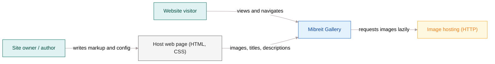
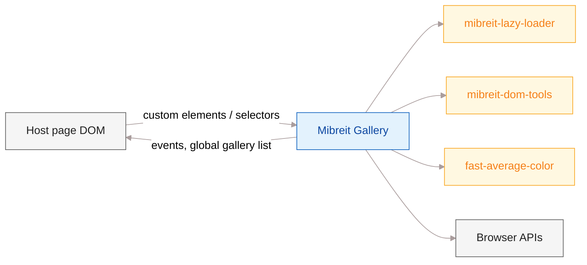
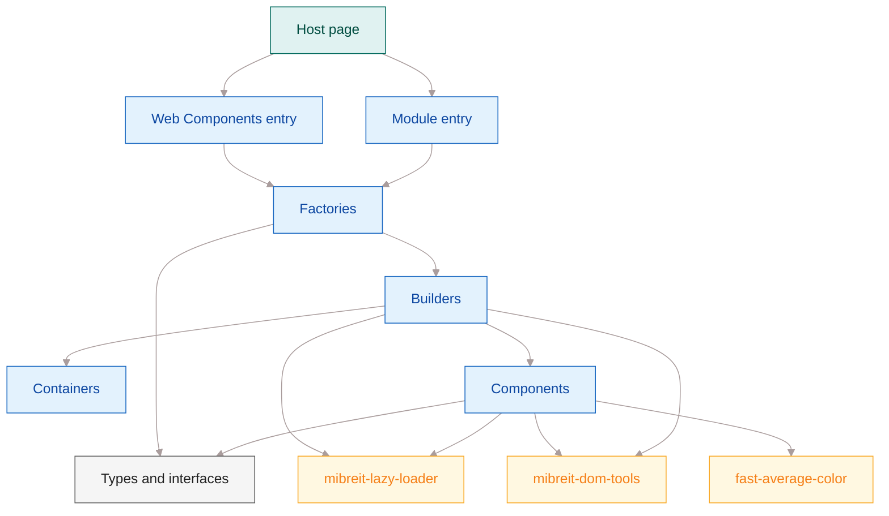
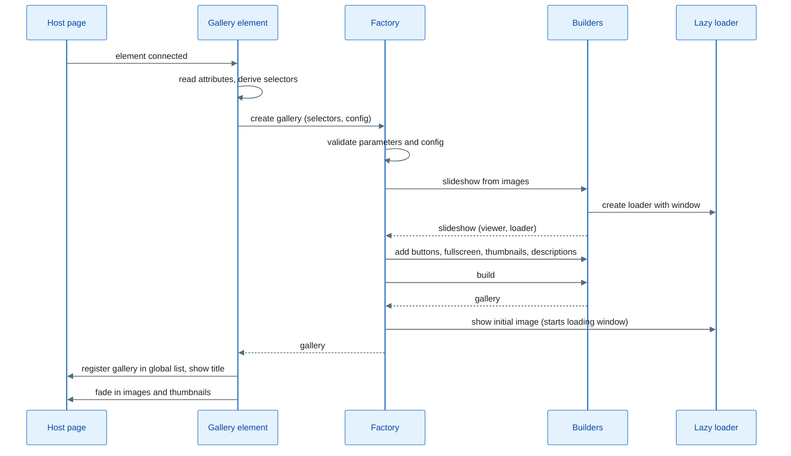
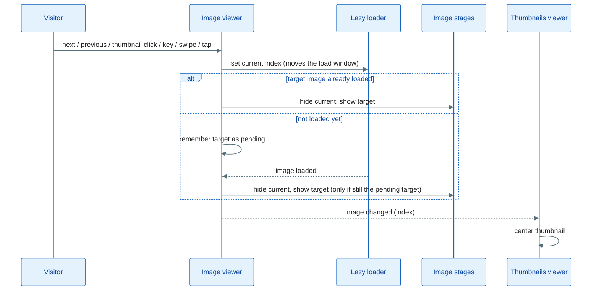
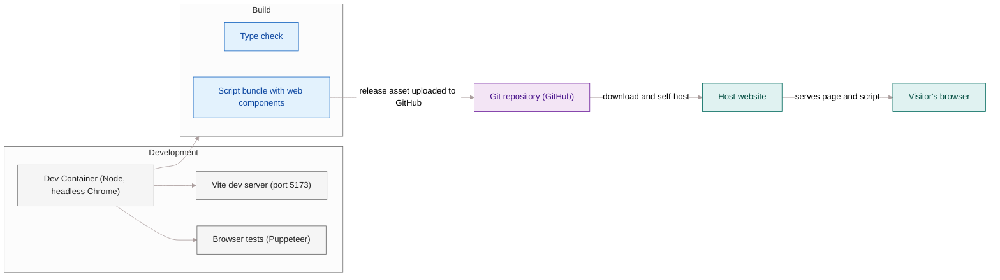

# Mibreit Gallery — Architecture

## 1. Introduction and Goals

Mibreit Gallery is a minimalistic image gallery for web pages, written in TypeScript. It was built for the photography website of Michael Breitung Photography and is published as open source. It aims for a fast viewing experience through lazy loading of images, and works without a UI framework.

### 1.1 Requirements Overview

The library offers these building blocks, which can be used on their own or combined:

| Capability              | Description                                                                                                                                                       |
| ----------------------- | ----------------------------------------------------------------------------------------------------------------------------------------------------------------- |
| Slideshow               | Shows one image at a time with configurable scale mode, optional zoom effect and optional automatic advance.                                                      |
| Thumbnail scroller      | Horizontally scrolling strip of thumbnails with a configurable number of visible thumbnails and previous/next navigation.                                         |
| Gallery                 | Combines slideshow and thumbnail scroller, plus fullscreen, previous/next buttons, keyboard and swipe navigation, and optional image descriptions.                |
| Fullscreen-only gallery | Displays regular page images as a clickable set that opens into a fullscreen slideshow.                                                                           |
| Images wall             | Multi-column wall of images that loads images as they scroll into view. Clicking an image opens it in fullscreen. It is an alternative to the thumbnail scroller. |
| Optional extras         | Per-image descriptions, a "buy" action for images with print metadata, and a fullscreen background that adapts to the average color of the current image.         |

The library is consumed in two ways:

- As a script bundle that declares custom HTML elements (the main way for galleries, slideshows, thumbnail scrollers and images walls).
- As the same script bundle whose global object exposes the factory functions. This is still in use, for example for the fullscreen-only gallery on the author's blog pages, which does not use a web component.

### 1.2 Quality Goals

| Priority | Goal                              | Motivation                                                                             |
| -------- | --------------------------------- | -------------------------------------------------------------------------------------- |
| 1        | Performance                       | Fast page load and smooth rendering, even for pages with many large photos.            |
| 2        | Ease of use                       | A site owner embeds a gallery with plain HTML and few attributes.                      |
| 3        | Maintainability and extensibility | One author maintains the code, and new components and scale modes must be easy to add. |
| 4        | Browser compatibility             | Works in all current evergreen browsers. Legacy browsers are not supported.            |

These goals are detailed as Q-1 to Q-4 in [section 10](#10-quality-requirements).

### 1.3 Stakeholders

| Stakeholder                                         | Expectations                                                              |
| --------------------------------------------------- | ------------------------------------------------------------------------- |
| Michael Breitung Photography (author and main user) | A fast, good-looking gallery on its own website, which is easy to evolve. |
| Open-source community                               | Usable, documented library. Currently there are no external contributors. |
| Website visitors (indirect)                         | Quick loading, smooth navigation, touch and keyboard support.             |

## 2. Architecture Constraints

### 2.1 Technical Constraints

| Constraint                                                                | Background                                                                                                                                                                                       |
| ------------------------------------------------------------------------- | ------------------------------------------------------------------------------------------------------------------------------------------------------------------------------------------------ |
| Targets modern evergreen browsers only                                    | Legacy browsers are explicitly out of scope. The code relies on resize observation, pointer events and custom elements.                                                                          |
| No UI framework dependency                                                | The library renders plain DOM and works on any page. The only runtime dependencies are two of the author's packages (the lazy loader and the DOM tools) and a third-party average-color package. |
| TypeScript in strict mode                                                 | The compiler is configured with strict checks, no unused locals or parameters, and an ES6 language target.                                                                                       |
| Distributed as one self-hosted artefact                                   | The script bundle includes the web components and exposes the factory functions. It is attached to a GitHub Release, downloaded by the site owner and hosted on the site (see [ADR-12](#adr-12)). |
| Build output is generated locally                                         | `npm run build` type-checks the source and creates the script bundle; generated folders are git-ignored and not versioned. See [TD-1](#td-1).                                                     |
| Own packages are installed from GitHub                                    | The lazy loader and the DOM tools are resolved from the author's GitHub repositories, not from the npm registry.                                                                                 |
| Images are plain `` elements supplied by the host page               | The gallery takes over images that are already in the page markup and reads source, title and description from their attributes. Nothing is fetched at runtime besides the images themselves.    |
| Gallery UI is a DOM overlay                                               | Fullscreen is implemented as an in-page overlay, not through the browser's Fullscreen API.                                                                                                       |

### 2.2 Organizational Constraints

| Constraint                     | Background                                                                                             |
| ------------------------------ | ------------------------------------------------------------------------------------------------------ |
| Single maintainer              | One author owns development, release and documentation. There are currently no external contributors.  |
| Open-source licence            | The project is released under the BSD-2-Clause licence.                                                |
| Development in a Dev Container | The toolchain (Node, system Chrome for the browser tests) is provided by a Docker-based Dev Container. |
| Browser-based tests            | Tests drive a real headless Chrome through Puppeteer and run against the built script bundle.          |

### 2.3 Conventions

| Convention                                 | Background                                                                                                                              |
| ------------------------------------------ | --------------------------------------------------------------------------------------------------------------------------------------- |
| CSS class prefix `mbg__`                   | All CSS Modules class names use this prefix and carry no hash (see [ADR-3](#adr-3)), so host pages can override styles.                 |
| Custom element names use the `mbg-` prefix | Applies to all web components (gallery, slideshow, thumbscroller, imageswall, plus the `images`, `thumbs` and `title` helper elements). |

## 3. System Scope and Context

### 3.1 Business Context

The library runs entirely in the visitor's browser, inside a web page that the site owner controls. It has no backend. The page supplies the images and their metadata in HTML. The library turns them into interactive galleries.

| Partner             | Interaction                                                                                                                                                                                                                                                                                                                                                                                                                             |
| ------------------- | --------------------------------------------------------------------------------------------------------------------------------------------------------------------------------------------------------------------------------------------------------------------------------------------------------------------------------------------------------------------------------------------------------------------------------------- |
| Site owner / author | Includes the bundle, writes the gallery markup (custom elements or plain images) and sets options as HTML attributes or factory arguments.                                                                                                                                                                                                                                                                                              |
| Host web page       | Supplies the images, titles (`title` or `data-title`), descriptions (`alt` and optional captions) and optional print metadata (`data-*` attributes). Each image that should be lazy loaded must carry the lazy-loading marker, either the class `mbll__marker` or a `data-src` attribute. Without either, the browser loads the image normally and the gallery cannot defer it. The host page also provides layout and style overrides. |
| Website visitor     | Navigates with mouse, touch (swipe), pointer and keyboard, and opens fullscreen.                                                                                                                                                                                                                                                                                                                                                        |
| Image hosting       | Plain HTTP image files that the browser fetches. The library only controls when the fetch starts.                                                                                                                                                                                                                                                                                                                                       |
| Library consumers   | Site owners who download the script bundle from a GitHub Release and host it with their page.                                                                                                                                                                                                                                                                                                                                          |

### 3.2 Technical Context

**Interfaces to the host page**

| Interface                                                          | Direction | Description                                                                                                                                                                                                                                                                                   |
| ------------------------------------------------------------------ | --------- | --------------------------------------------------------------------------------------------------------------------------------------------------------------------------------------------------------------------------------------------------------------------------------------------- |
| Custom elements (gallery, slideshow, thumbscroller, imageswall)    | in        | Declarative entry point, configured by attributes. Child helper elements mark the images, thumbnails and title.                                                                                                                                                                               |
| Factory functions                                                  | in        | Imperative entry point. Takes CSS selectors and a config object and is available through the global object of the script bundle.                                                                                                                                                               |
| Lazy-loading marker (`mbll__marker` class or `data-src` attribute) | in        | Opt-in signal on each image element. It tells the lazy loader to hold the image back until the gallery requests it. The class is defined by `mibreit-lazy-loader`, not by this library. Demo pages also hide the marker class with CSS so that images that are not yet loaded stay invisible. |
| `buy-clicked` DOM event                                            | out       | Dispatched by the images wall element (when the `addBuyButton` attribute is set) with the image index.                                                                                                                                                                                        |
| Global list of gallery objects                                     | out       | The script bundle exposes created gallery objects on the page's global scope for host scripts.                                                                                                                                                                                                |
| CSS custom properties on the document root                         | out       | The fullscreen view publishes the current image's average background and foreground colors. The host page can use them.                                                                                                                                                                       |
| CSS class names                                                    | in/out    | The gallery sets and uses class names with the `mbg__` prefix. The host page can override them.                                                                                                                                                                                               |

**Interfaces to external packages and the platform**

| Partner               | Used for                                                                                                                         |
| --------------------- | -------------------------------------------------------------------------------------------------------------------------------- |
| `mibreit-lazy-loader` | Index-based lazy loading around the current image for galleries and slideshows. Scroll-window-based loading for the images wall. |
| `mibreit-dom-tools`   | Abstraction of DOM creation, styling and event registration.                                                                     |
| `fast-average-color`  | Computes the average color of the current image for the fullscreen background.                                                   |
| Browser APIs          | DOM, custom elements, resize observation, pointer and keyboard events, CSS animations and transforms.                            |

## 4. Solution Strategy

### 4.1 Approach in Brief

| Goal (see [section 1](#12-quality-goals)) | Strategy                                                                                                                                                                                              | Where it shows                                                                                                        |
| ----------------------------------------- | ----------------------------------------------------------------------------------------------------------------------------------------------------------------------------------------------------- | --------------------------------------------------------------------------------------------------------------------- |
| Performance (Q-1)                         | Images are fetched only when they are close to being viewed. The page keeps its images as ordinary `` elements. There is no framework and there are no network calls besides image loading.      | Index-window lazy loading for slideshow, gallery and thumbnails. Scroll-based lazy loading for the images wall (4.2). |
| Ease of use (Q-2)                         | Two entry paths over the same core. Custom HTML elements configure everything through attributes. Factory functions cover pages that use the script directly. Defaults are provided for all options.  | Web-component bundle and factory functions (4.3).                                                                     |
| Maintainability and extensibility (Q-3)   | A layered structure: factories validate input, builders assemble, components do one job each, and interfaces separate consumers from implementations. Scale modes are interchangeable stage variants. | Building Block View ([section 5](#5-building-block-view)).                                                            |
| Browser compatibility (Q-4)               | Only standard web platform features are used, with no polyfills and no legacy support.                                                                                                                | [Section 2](#2-architecture-constraints).                                                                             |

### 4.2 Lazy Loading Strategies

Lazy loading is provided by the separate `mibreit-lazy-loader` package. The gallery chooses a strategy per component:

| Component             | Strategy                                           | Behaviour                                                                                                                                                                                                                         |
| --------------------- | -------------------------------------------------- | --------------------------------------------------------------------------------------------------------------------------------------------------------------------------------------------------------------------------------- |
| Slideshow and gallery | **Index-based window**                             | Images within a configurable window around the current index (default: none before, one after) are loaded. Changing the image moves the window. If a requested image is not loaded yet, the viewer waits for it before switching. |
| Thumbnail scroller    | **Index-based window over the visible thumbnails** | The window starts at the first thumbnail and spans the number of visible thumbnails.                                                                                                                                              |
| Images wall           | **Scroll-based window**                            | Images load once their placeholder scrolls into view, after a configurable delay. Placeholders reserve the image's aspect ratio, so the layout does not jump.                                                                     |

All three depend on the host page marking images as deferred (see [section 3](#3-system-scope-and-context)). Images without the marker are loaded by the browser as usual.

### 4.3 Entry Paths and Composition

- **Declarative entry:** a script bundle registers custom elements. Each element reads its attributes, derives selectors for its child images and delegates to the matching factory.
- **Imperative entry:** factory functions take CSS selectors and a config object, validate both, and delegate to a builder. Factories exist for slideshow, thumbnail scroller, gallery, fullscreen-only gallery and images wall.
- **Composition by builders:** the gallery builder starts from a slideshow and adds optional features (previous/next buttons, fullscreen, thumbnails, descriptions, buy action). The same builder serves the fullscreen-only gallery, which clones the page's images into a hidden container and shows it only when fullscreen is active.
- **Images stay in the page's DOM:** components wrap and style the host page's `` elements instead of re-creating them. Title, description and print metadata are read from the element's attributes (see [ADR-1](#adr-1) and [ADR-8](#adr-8)).

### 4.4 Rendering and Layout

- **Stages scale and center images:** each image sits on an image stage that handles scaling and centering. Four scale modes (none, fit aspect, stretch, expand) are interchangeable stage variants. A resize observer keeps stages in sync with their container.
- **CSS-driven presentation:** styles ship as CSS Modules with a fixed `mbg__` prefix and no hash. The host page can override them (see [ADR-3](#adr-3)).
- **Fullscreen as overlay:** the fullscreen view moves the gallery into an overlay in the page. A placeholder keeps the original position, so the page layout does not change.
- **Adaptive color:** optionally, the average color of the current image controls the fullscreen background and foreground color.

### 4.5 Build and Distribution

- **One source tree, one distributed artefact:** the script bundle registers the web components and exposes the factory functions on a global object.
- **Type checking without shipping declarations:** `tsc --noEmit` checks the source; declarations are not generated or distributed.
- **Dev Container and browser tests:** development runs in a Dev Container. `npm test` builds the bundle first, then runs the tests in headless Chrome against it.
- **Console output removed at build:** `console` calls are stripped from the script bundle (see [section 8](#86-logging)).
- **Release asset, not committed output:** `scripts/release-iife.sh` builds the bundle and uploads it to a GitHub Release; generated output is git-ignored (see [ADR-12](#adr-12)).

## 5. Building Block View

### 5.1 Level 1: Whitebox Overall System

The library is split into layers. Each layer only calls the layer below it, plus shared types and interfaces.

| Building block       | Responsibility                                                                                                                                                                                                                                            |
| -------------------- | --------------------------------------------------------------------------------------------------------------------------------------------------------------------------------------------------------------------------------------------------------- |
| Web Components entry | Script bundle entry. Registers the custom elements, maps attributes to factory calls, publishes created galleries on a page-global list, relays the buy event, and fades the gallery in once it is ready.                                                 |
| Module entry         | Source entry that exports the factory functions, the components and the scale-mode and position types. The script bundle re-exports it, so factories are also available on its global.                                                                  |
| Factories            | One function per use case (slideshow, thumbnail scroller, gallery, fullscreen-only gallery, images wall). Each validates its parameters and configuration, resolves the selectors in the page and delegates to a builder. They throw if nothing is found. |
| Builders             | Assemble components into a working result. Each builder creates the image wrappers, lazy loader and viewer, wires them together (callbacks, keyboard, swipe, hover) and builds the container object.                                                      |
| Containers           | Plain result objects (slideshow, gallery) that give the host page access to the image viewer, loader, thumbnails and fullscreen.                                                                                                                          |
| Components           | The single-purpose UI parts (see 5.2).                                                                                                                                                                                                                    |
| Types and interfaces | The configuration types with their validation functions, the scale-mode and position types, and the interfaces that components and containers implement.                                                                                                  |
| Tools                | Small helpers for timing and animation.                                                                                                                                                                                                                   |
| Static assets        | Icons and CSS Modules bundled with the library.                                                                                                                                                                                                           |

### 5.2 Level 2: Components

| Component                          | Responsibility                                                                                                                                                                                                                                                                                                                      |
| ---------------------------------- | ----------------------------------------------------------------------------------------------------------------------------------------------------------------------------------------------------------------------------------------------------------------------------------------------------------------------------------- |
| Image                              | Wraps a page image. Is lazy-loadable, and exposes title, description, URL and `data-*` metadata, including whether print metadata exists. Limits the image's maximum size to its declared size and disables the context menu and dragging.                                                                                          |
| Image viewer                       | Keeps the list of images and the current index. Shows next, previous or a specific image (wrapping around), defers the switch until a not-yet-loaded image has loaded, and notifies image-changed listeners.                                                                                                                        |
| Image stage (and four scale modes) | Scales and centers one image in its container, handles show and hide transitions and the optional zoom effect. One variant each for no scaling (removes any size), fit aspect (fits the container but never exceeds the image's declared size), stretch (fills the container in both directions) and expand (covers the container). |
| Thumbnail stage                    | An expand-mode stage for a thumbnail that also reports clicks.                                                                                                                                                                                                                                                                      |
| Thumbnails viewer                  | Sizes the thumbnails to the available width and the number of visible thumbnails, scrolls them (with wraparound for paging), and reports the scroll index.                                                                                                                                                                          |
| Horizontal scroller                | Moves a row of elements horizontally by a transform. Used by the thumbnails viewer.                                                                                                                                                                                                                                                 |
| Swipe handler                      | Detects horizontal swipes from pointer events (distance and time thresholds).                                                                                                                                                                                                                                                       |
| Fullscreen                         | Moves the gallery into an in-page overlay, leaves a placeholder, provides a close button, and notifies listeners. Supports a fixed or average-color background.                                                                                                                                                                     |
| Average color                      | Computes the average color of an image and publishes it as background and foreground CSS variables on the document root.                                                                                                                                                                                                            |
| Image description                  | Overlay that shows an image's description with a close control.                                                                                                                                                                                                                                                                     |
| Images wall                        | Arranges images in columns, placing each into the currently shortest column, and waits for decoding before display.                                                                                                                                                                                                                 |

### 5.3 Level 2: Builders

| Builder                    | Responsibility                                                                                                                                                                                                                                                           |
| -------------------------- | ------------------------------------------------------------------------------------------------------------------------------------------------------------------------------------------------------------------------------------------------------------------------ |
| Slideshow builder          | Creates the images, the index-based lazy loader and the image viewer. Optionally starts an automatic advance timer and applies the zoom option.                                                                                                                          |
| Thumbnail scroller builder | Creates thumbnail stages, a lazy loader sized to the visible thumbnails, the thumbnail viewer, optional previous/next buttons, and swipe scrolling.                                                                                                                      |
| Gallery builder            | Starts from a slideshow and adds the optional features: previous/next buttons, fullscreen, thumbnails, descriptions, buy action, keyboard and swipe navigation. Has a second start mode that clones page images into a hidden container for the fullscreen-only gallery. |
| Images wall builder        | Creates the wall and attaches the scroll-based lazy loader, an optional click callback and a configurable scroll delay.                                                                                                                                                  |

### 5.4 Public Contracts

The interfaces that consumers use directly:

| Interface             | Provides                                                                                                       |
| --------------------- | -------------------------------------------------------------------------------------------------------------- |
| Image viewer          | Navigation, current index, image information, image-changed callbacks, zoom switch.                            |
| Thumbnails viewer     | Center a thumbnail, scroll previous and next, scroll-index callbacks.                                          |
| Fullscreen            | Activate, deactivate, state and change callbacks, background color control.                                    |
| Slideshow and gallery | Access to viewer and loader. For galleries also thumbnails and fullscreen, and showing or hiding descriptions. |
| Image information     | Title, description, URL, metadata, print-metadata check.                                                       |

## 6. Runtime View

### 6.1 Gallery Start-up (web component)

When the browser connects a gallery element, the element starts the gallery synchronously.

Steps and rules:

1. The element gives itself a unique class and derives selectors for its images and thumbnails from it.
2. The factory throws if a selector is not a string, the configuration is invalid, or no images are found.
3. Previous/next buttons, swipe handling and keyboard navigation are only added if there is more than one image.
4. Thumbnails are only created if the page provides more than one thumbnail. Otherwise the thumbnail container is hidden.
5. Descriptions are created from the page's figure captions if there are any.
6. The initial image (default: the first one) is shown, which starts loading around it.
7. If a title element exists on the page, it shows the current image's title and follows changes.
8. Gallery and thumbnails stay invisible until the element makes them visible with a fade-in (see [ADR-11](#adr-11)).

### 6.2 Changing the Image

Rules:

- Navigation wraps around at both ends.
- If several changes are requested while an image is still loading, only the latest pending target is shown.
- Swipe left or right slides the images in the swipe direction. Tap, key and button navigation switch without sliding.
- A tap or click without a swipe moves forward on the right half and back on the left half of the gallery.
- Keyboard: arrow keys change the image. In fullscreen, Escape closes and the `f` key toggles it.
- Keyboard handlers are registered on the whole document, not on a single gallery (see [TD-9](#td-9)).
- When the optional interval is set, a timer advances to the next image continuously. It does not stop on user interaction (see [TD-10](#td-10)).

### 6.3 Fullscreen

1. Activation moves the gallery container into an overlay appended to the page body and leaves a placeholder at the original position.
2. The overlay uses either a fixed background color or the average color of the current image, which is recalculated on each image change.
3. Deactivation puts the container back at the placeholder and removes the overlay.
4. Change listeners are notified of both transitions. Fullscreen-only galleries use this to show or hide their (otherwise hidden) container.

### 6.4 Images Wall with Fullscreen Viewing

The images wall is an alternative to the thumbnails viewer.

1. The images-wall element first creates a fullscreen-only gallery. It clones the page's images into a hidden container and registers a click handler on each original image.
2. It then builds the wall. The original images are distributed into columns, always into the currently shortest column, and loaded by scroll position.
3. When a visitor clicks an image, the gallery shows the matching image and activates fullscreen.
4. If the buy option is set and the current image has print metadata, a shop button appears. It dispatches the buy event with the image index.

### 6.5 Resizing

- Each image stage observes its container's size and recalculates its image size on change, and after its image has loaded.
- The thumbnails viewer observes its wrapper, recomputes the thumbnail size from the wrapper width and the number of visible thumbnails, and re-centers.

## 7. Deployment View

The library has no server-side deployment. Its "deployment" is the production of one script bundle and its delivery into a web page, where it runs in the visitor's browser. The sections below cover the development environment, the build pipeline and the artefact.

### 7.1 Infrastructure Level 1

| Node            | Purpose                                                                                                                                                                            |
| --------------- | ---------------------------------------------------------------------------------------------------------------------------------------------------------------------------------- |
| Dev Container   | Docker-based development environment with Node and Chrome. It mounts the project folder and the host SSH keys, and publishes the dev-server port.                                  |
| Vite dev server | Serves the demo pages from the source tree for manual testing. It bundles the TypeScript sources, SVG icons and CSS Modules on the fly.                                            |
| Browser tests   | Puppeteer (puppeteer-core, using the system Chrome) starts headless Chrome, loads test pages, injects the built script bundle and checks the result. The tests need a prior build. |
| Git repository  | Holds the sources and hosts GitHub Releases that carry the script bundle.                                                                                                          |
| Host website    | Any site that downloads a released script bundle and serves it itself.                                                                                                            |

### 7.2 Build Pipeline

A single `npm run build` runs two steps in sequence:

| Step                       | Result                                                                                            |
| -------------------------- | ------------------------------------------------------------------------------------------------- |
| Type check (`tsc --noEmit`) | Checks the TypeScript source without emitting declarations.                                        |
| Script build (Vite/Rollup) | Creates one minified script file (`lib-iife`) with the web components. Its global is `mibreitGalleryTs`. |

Common build properties:

- SVG icons are inlined as strings through a small custom Vite plugin, so dev and build behave the same.
- CSS Modules are generated with the fixed `mbg__` prefix and no hash.
- `console` calls in the gallery sources and in the lazy loader package are stripped from the script build.
- There is no linting step and no CI workflow in the repository (see [TD-13](#td-13)).

### 7.3 Artefacts

| Artefact   | Content                                                                                        | Consumed by                                                            |
| ---------- | ---------------------------------------------------------------------------------------------- | ---------------------------------------------------------------------- |
| `lib-iife` | Minified script bundle that includes the web components and exposes the factories on a global. | GitHub Releases, web pages (script tag), browser tests, and the demo.  |

### 7.4 Delivery to a Website

After a release is created and tagged on GitHub, `scripts/release-iife.sh` builds the bundle and uploads it as a release asset. The script requires the GitHub CLI and an authenticated `gh` account.

Site owners download the release asset, host it with their website and update their hosted copy for a new release. Loading the script from a CDN or another external host is not supported or recommended.

The host page includes the script bundle with a script tag, and the gallery markup (custom elements or images with the lazy-loading marker) must already be in the page's HTML (see [section 3](#3-system-scope-and-context)).

## 8. Cross-cutting Concepts

### 8.1 Configuration and Input Validation

- Every factory validates its parameters at the boundary and throws an error with a descriptive message for invalid input. Typical cases are non-string selectors, wrong option types or ranges, an invalid color format, and selectors that match no images.
- Configuration is a plain object of optional fields. Defaults are applied where a value is consumed. They come from named constants, for example the lazy-loading window and the number of visible thumbnails.
- The web-component entry converts attributes to numbers or booleans and passes them to the same factories. Attributes that are absent become `undefined`, so the factory defaults apply.
- There is no recovery from invalid configuration. The error surfaces in the browser console and the gallery does not start.

### 8.2 Host Page Contract

The host page provides all data in its HTML (see [section 2](#2-architecture-constraints) and [section 3](#3-system-scope-and-context)). The library reads, per image:

| Source                    | Used for                                                                                                                          |
| ------------------------- | --------------------------------------------------------------------------------------------------------------------------------- |
| `src` or `data-src`       | Image location. Lazy loading applies if the marker class or `data-src` is present (see [section 3](#3-system-scope-and-context)). |
| `title` or `data-title`   | Image title. A `title` attribute is moved to `data-title`, which removes the browser tooltip.                                     |
| `alt`                     | Image description when no figure caption is present.                                                                              |
| Figure caption            | Description text, if the number of captions equals the number of images.                                                          |
| `width`, `height`         | Natural size for aspect-ratio handling. The image's maximum size is limited to this size.                                         |
| Other `data-*` attributes | Image metadata. Print size or print URL mark an image as available for purchase.                                                  |

The library also disables the context menu and dragging on gallery images.

### 8.3 Styling and Theming

- **CSS Modules with a fixed prefix:** class names use the prefix `mbg__` without a hash, so host pages can override them (see [ADR-3](#adr-3)).
- **Global stylesheet for the web components:** the script bundle includes a stylesheet that defines the layout of the custom elements, default colors and icon styling. The module source entry does not import it (see [TD-11](#td-11)).
- **Colors through CSS variables:** `--background-color` and `--foreground-color` are defined on the document root. Defaults are dark. With the average-color option, the library overwrites them at each image change. Icons use the foreground color.
- **Icons as inlined SVG:** icons are bundled as strings and inserted into the DOM, so they can be colored by CSS.
- **Fade-in against unstyled flashes:** gallery and thumbnail containers start fully transparent and are faded in by the web component once the gallery is built. This avoids a flash of unstyled content and makes sure images fade in properly (see [ADR-11](#adr-11)). Buttons and overlays use a shared fade transition.
- **Hover-dependent controls:** buttons are faded in while the pointer is over the gallery and faded out otherwise.

### 8.4 Callbacks and Events

- **Listener lists:** components that change state (image viewer, fullscreen, thumbnails viewer, image description) keep a list of change callbacks. Registering the same callback twice has no effect.
- **No event bus:** builders wire components together by registering callbacks. For example, an image change moves the thumbnails, the average color and the shop button.
- **Page-level events:** the only DOM event the library dispatches is the buy event, from the images wall element.
- **Input handling:** pointer events (not mouse or touch events) drive swipe, tap and button handling. Button handlers stop event propagation, so a click on a button does not also count as a swipe or tap on the gallery.

### 8.5 Asynchronous Behaviour and Timing

- Lazy loading, image decoding and transitions are asynchronous. Components synchronize on the image's loaded callback, a render-completed wait (two animation frames), and fixed timers.
- Resizing is handled by resize observers, not by window events.
- Transition timings are constants in the code and in CSS.

### 8.6 Logging

- Diagnostic output uses `console.log` at many places in the sources. Both builds strip all `console` calls, including those of the lazy loader package, so production bundles are silent. The Vite dev server keeps them.
- The library never logs warnings or errors itself. Errors are thrown.

### 8.7 Testing

- Browser tests run the built script bundle in headless Chrome against prepared HTML pages (web-component gallery, single-image gallery, thumbnail scroller).
- Small unit tests cover factory parameter validation and configuration checks. They run without a DOM.
- There is no test for the images wall, fullscreen or swipe (see [TD-13](#td-13)).

> ⚠️ TODO: verify the test scope.

### 8.8 Accessibility

The sources contain no ARIA attributes, roles or focus handling. Keyboard support is limited to arrow keys, Escape and the `f` key, handled on the whole document. Buttons are plain `div` elements (see [TD-12](#td-12)).

> ⚠️ TODO: verify.

### 8.9 Extensibility

New scale modes extend the common stage base class and are selected in the image viewer. New features are added to a gallery as builder methods that attach to the slideshow, which keeps factories and containers unchanged.

## 9. Architecture Decisions

Each decision states its context and consequences. Where the author gave the rationale, it is recorded as given. Where a decision was derived from the code and the rationale is not known, it is marked with a TODO. The author intends to review several of these decisions later, which the status line makes explicit.

#### ADR-1

**Images are provided in the page's HTML.** The gallery works on `` elements that are already in the page. It never fetches image lists or other data at runtime.

- **Context:** The author builds sites with tools that produce static, HTML-only pages and wants as few fetch calls as possible.
- **Consequences:** No server API is needed and the pages stay simple. Every image needs its attributes (title, size, lazy-loading marker) in the HTML. The host page decides what is part of a gallery.
- **Status:** Accepted.

#### ADR-2

**Two lazy-loading strategies.** Index-based windowed loading serves slideshows, galleries and thumbnails. Scroll-position-based loading (an image loads once it becomes visible) serves the images wall.

- **Context:** A slideshow shows one image at a time and can predict which images come next. A wall shows many images at once and the visitor's scroll position decides.
- **Consequences:** Both strategies come from one external package. The host page must mark images for deferral (see [section 3](#3-system-scope-and-context) and [TD-8](#td-8)).
- **Status:** Accepted.

#### ADR-3

**CSS Modules with a fixed prefix and without hashes.** Class names are generated as `mbg__<name>`.

- **Context:** Host pages should be able to override the gallery's styles from the outside, and the prefix keeps the risk of clashes low.
- **Consequences:** Class names form a de facto public styling API. Renaming a class is a breaking change for hosts that override it.
- **Status:** Accepted.

#### ADR-4

**Two entry points from one source tree.** The web-component entry produces the script bundle for pages and re-exports the module entry's factory functions and components on its global.

- **Context:** Web components are now the usual way to embed galleries. The module entry (and its factories, available on the script bundle's global) remains in use, for example for the fullscreen-only gallery on the author's blog pages, which does not use a web component.
- **Consequences:** Two entry files must be kept in sync, and their relationship is not obvious. The web-component entry re-exports the module entry.
- **Status:** Accepted. Under review: the author wants to look at cleaning up the entry points (see [TD-2](#td-2)).

#### ADR-5

**Build output is committed to the repository.**

- **Context:** The library was designed so that it could be installed with `npm install` straight from the Git repository, without having to build it.
- **Consequences:** The repository contains generated files, which makes diffs noisy and risks stale output. The browser tests and some demos depend on the committed bundle.
- **Status:** Superseded by [ADR-12](#adr-12). Build output is no longer committed; TD-1 is resolved (see [TD-1](#td-1)).

#### ADR-6

**Lazy loader and DOM tools are separate packages.** Both are the author's own packages, installed from GitHub.

- **Context:** The packages were developed separately from the gallery. The DOM tools were meant as an abstraction layer to adapt easily to changes in the DOM environment.
- **Consequences:** The gallery depends on two GitHub-hosted packages whose versions are not pinned to a release. The lazy loader's types are part of the gallery's public interfaces. The author questions whether the DOM tools are still worth their overhead, now that such abstractions are cheap to generate.
- **Status:** Accepted. Under review for the DOM tools (see [TD-3](#td-3) and [TD-4](#td-4)).

#### ADR-7

**Layered construction: factories, builders, components, interfaces.** Factories validate and resolve selectors, builders assemble optional features, components do one job, and interfaces separate consumers from implementations.

- **Context:** Maintainability and extensibility are quality goals (see [section 1](#12-quality-goals)). One builder serves several use cases, such as the gallery and the fullscreen-only gallery.
- **Consequences:** New features are added as builder methods and new components, with little change to existing code. There are more files and indirection than the code size alone would call for.
- **Status:** Accepted.

#### ADR-8

**Images stay the host page's own elements.** Components wrap and restyle the page's `` elements instead of creating new ones, and the images wall moves them into columns.

- **Context:** This follows from [ADR-1](#adr-1). Title, description and metadata are attributes of these elements.
- **Consequences:** The page's markup is modified at runtime, and the original elements are the ones shown, so the page's own CSS and attributes (such as the browser's native lazy-loading attribute) still apply.
- **Status:** Accepted.

#### ADR-9

**Fullscreen as an in-page overlay.** Fullscreen moves the gallery into an overlay on the page instead of using the browser's Fullscreen API.

- **Context:** Fullscreen is implemented as an in-page overlay rather than using the browser's Fullscreen API, keeping the browser's chrome visible.
- **Consequences:** The browser's chrome remains visible. A placeholder keeps the page layout stable. Fullscreen state is controlled by the library, so Escape and the `f` key are handled by its own key listeners.
- **Status:** Accepted - But, in the future, we will add an option to use the browser's Fullscreen API in addition to the in-page overlay.

#### ADR-10

**Web components without shadow DOM.** The custom elements render into the page's regular DOM and select their children with CSS selectors.

- **Context:** > It follows from [ADR-3](#adr-3) (styles are overridable from the page) and [ADR-1](#adr-1) (the page's own markup is used). We don't want an isolated shadow DOM and use the Web Components only to simplify the markup and the gallery's start-up.
- **Consequences:** Host styles apply directly. Elements can be found by page scripts. Styles of the page can also clash with the gallery's styles.
- **Status:** Accepted.

#### ADR-11

**Fade-in through opacity.** Gallery and thumbnail containers start transparent and are faded in once the gallery is built.

- **Context:** Avoids a flash of unstyled content and makes sure that images fade in properly (see [section 8](#83-styling-and-theming)).
- **Consequences:** If the script fails or is blocked, the images stay invisible (see [TD-15](#td-15)).
- **Status:** Accepted.

#### ADR-12

**The script bundle is the only distributed artefact, delivered as a GitHub Release asset. The ES module build is dropped.** Build output is not committed. Users download the bundle and host it themselves.

- **Context:** The author has no npm account and does not want to publish to a registry. The author's own sites use the script bundle. Self-hosting needs no third-party request at page load and gives the visitor's browser no external script to trust, so loading from a CDN or another external host is neither supported nor recommended. Nobody consumes the ES module today (see [ADR-5](#adr-5)).
- **Consequences:** Only one build output remains. It is produced on demand, and `scripts/release-iife.sh` uploads it to a GitHub Release. Developers who want the module for a bundler are not served for now, and consumers must update the hosted file themselves to get a new version. The type declarations are no longer shipped, but the type check stays part of the build.
- **Status:** Accepted and implemented (ticket `release-iife-via-github`).

**Options for later.** None of these is decided. They are recorded so they need not be researched again.

- **Release tarball:** attach the packed package (the output of `npm pack`) to the GitHub Release. Consumers install it with `npm install` and the tarball's URL, which npm supports for any http(s) tarball. It needs no registry account and contains prebuilt files, so consumers need no build step. Consumers would still resolve the two GitHub-hosted dependencies (see [ADR-6](#adr-6)). It would require the ES module build and type declarations to come back. > ⚠️ TODO: verify. Installing from a GitHub release asset URL (which redirects) has not been tried here.
- **Install from Git with a `prepare` script:** consumers install straight from the repository and the package builds on their machine. It needs no release asset, but every install runs a full build and needs the development dependencies. It also requires the ES module build to return.
- **Publish to the npm registry:** the usual route for module consumers. It needs an account and the companion packages published or bundled (see [TD-4](#td-4)), and the dependencies would have to be declared properly instead of installed from GitHub.
- **Rejected:** GitHub's package registry (installing requires authentication, even for public packages), and serving the script from a CDN or the release URL directly (conflicts with the self-hosting decision).

## 10. Quality Requirements

### 10.1 Quality Requirements Overview

The goals and their priority come from [section 1](#12-quality-goals). Each row says how the goal shows up in the system today.

| ID  | Quality goal                      | Manifests as                                                                                                                                                                                                                                                                                                                                                        |
| --- | --------------------------------- | ------------------------------------------------------------------------------------------------------------------------------------------------------------------------------------------------------------------------------------------------------------------------------------------------------------------------------------------------------------------- |
| Q-1 | Performance                       | Images are fetched only when needed: a small window around the current image (slideshow, gallery, thumbnails) or the visible area (images wall). Placeholders reserve the image's aspect ratio, so the layout does not jump during loading. There are no runtime network calls besides images, and no framework. The script bundle is a single file of about 60 KB. |
| Q-2 | Ease of use                       | A gallery is a custom element with plain HTML inside and a few attributes. All options have defaults. Invalid configuration fails with a descriptive error. Several demo pages show each use case.                                                                                                                                                                  |
| Q-3 | Maintainability and extensibility | Layered structure with single-purpose components and interfaces (see [ADR-7](#adr-7)). Strict TypeScript. New scale modes and new gallery features fit existing extension points (see [section 8](#89-extensibility)).                                                                                                                                              |
| Q-4 | Browser compatibility             | Only standard platform features are used, targeting current evergreen browsers (see [section 2](#2-architecture-constraints)). No polyfills and no legacy support.                                                                                                                                                                                                  |

### 10.2 Quality Scenarios

| ID  | Scenario                                                                       | Expected response                                                                                                            |
| --- | ------------------------------------------------------------------------------ | ---------------------------------------------------------------------------------------------------------------------------- |
| Q-1 | A visitor opens a page with a gallery of many large photos.                    | Only the first image and its neighbors within the configured window are requested. The rest follow as the visitor navigates. |
| Q-1 | A visitor scrolls through an images wall.                                      | Images load as they approach the visible area. The wall does not shift while they load.                                      |
| Q-2 | A site owner adds a gallery to an HTML page.                                   | They include the script and write the custom element with its images. No JavaScript is needed.                               |
| Q-3 | The author adds a new image scale mode.                                        | A new stage variant and one selection branch are added. Factories and builders remain unchanged.                             |
| Q-4 | A visitor uses a current Chrome, Firefox, Safari or Edge, on desktop or touch. | The gallery works with mouse, keyboard and touch.                                                                            |

> ⚠️ TODO: verify. None of these scenarios has a measurable target (for example a maximum number of image requests on load, a bundle size budget, or a tested browser list), and nothing in the repository measures them. The automated tests check functionality in headless Chrome only.

## 11. Risks and Technical Debt

The items are numbered in the order they were found, which is not a priority order.

#### TD-1

**Resolved:** Build output is no longer committed. TD-1 was the 119 tracked generated files, including copied dependency output. [ADR-12](#adr-12) dropped the ES module build, added the script bundle as a GitHub Release asset and made `npm test` build the bundle first. See also [ADR-5](#adr-5).

#### TD-2

**Two source entry points with unclear roles.** The web-component entry re-exports the module entry, so the script bundle exposes the factories. The author uses both entry paths: the fullscreen-only gallery on blog pages through the script's global, and web components elsewhere. The entry files still need cleaning up, even though the ES module build has been dropped. See [ADR-4](#adr-4).

#### TD-3

**The DOM tools package may no longer be worth its overhead.** It was introduced as an abstraction layer to adapt to DOM changes. The author considers that such abstractions are now cheap to generate. Removing it would also remove one external dependency from the bundle. See [ADR-6](#adr-6).

#### TD-4

**Own dependencies are installed from GitHub without a pinned version.** The manifest references both packages by repository only, so installs depend on their default branch. The lazy loader's types are also part of the gallery's public interfaces. See [ADR-6](#adr-6).

#### TD-6

**Unused code.** Several constants are not referenced anywhere (the data-src and src attribute names, the stage CSS class, the slideshow interval, the resize debounce timer), and the debounce helper is not used either.

#### TD-7

**A stale lazy-loader bundle sits in the repository root.** The file `mibreitLazyLoader.min.js` is a built copy of the lazy-loader package. Nothing in the repository references it.

#### TD-8

**The lazy-loading contract fails silently.** An image without the marker class or `data-src` attribute is not deferred and is loaded by the browser as usual. Nothing warns the site owner. The README explains the requirement, but the library itself does not check it. See [ADR-2](#adr-2).

#### TD-9

**Keyboard handlers are global.** Arrow, Escape and `f` keys are registered on the whole document for each gallery. With several galleries on one page, all of them react to the same key press, and `f` toggles fullscreen in every one.

#### TD-10

**No lifecycle management.** The automatic advance timer never stops, not on user interaction and not when the gallery is out of view. None of the document-level listeners and resize observers are ever removed. There is no teardown, which matters for single-page applications and for pages that remove galleries.

#### TD-11

**Historical: the module entry did not include the global stylesheet.** This no longer affects a distributed artefact because the ES module build was dropped. The module source entry remains part of the codebase and still needs cleanup with TD-2.

> ⚠️ TODO: verify whether this is intended.

#### TD-12

**Accessibility is not addressed.** Buttons are plain `div` elements with no labels, roles or keyboard focus. Keyboard support is limited to a few keys, and descriptions and fullscreen are not announced to assistive technology. This also relates to [ADR-9](#adr-9).

#### TD-13

**Quality assurance is thin.** There is no linting step and no CI workflow. Browser tests run in headless Chrome only and build the bundle automatically. They cover the web-component gallery, a single-image gallery and the thumbnail scroller. Nothing covers the images wall, fullscreen, swipe or other browsers. No quality goal has a measurable target (see [section 10](#10-quality-requirements)).

#### TD-14

**Diagnostics and typing shortcuts.** Debug output relies on `console.log` calls that are removed only by the build, so development builds are noisy. The timing helpers contain two `@ts-ignore` comments.

#### TD-15

**No fallback when the script does not run.** The gallery and thumbnail containers are transparent by default and become visible only through the script. If the script fails, is blocked or loads late, the images stay invisible. See [ADR-11](#adr-11).

## 12. Glossary

| Term                    | Definition                                                                                                                                                |
| ----------------------- | --------------------------------------------------------------------------------------------------------------------------------------------------------- |
| Host page               | The web page that includes the library and provides the images, their attributes and the layout.                                                          |
| Site owner              | The person who writes the host page's HTML and configures the galleries.                                                                                  |
| Gallery                 | A slideshow combined with an optional thumbnail scroller, fullscreen, descriptions and a buy action.                                                      |
| Slideshow               | Shows one image at a time, with optional automatic advance and zoom effect.                                                                               |
| Thumbnail scroller      | A horizontally scrolling strip of thumbnails. Also called the thumbnails viewer in the code.                                                              |
| Images wall             | A multi-column arrangement of images, loaded by scroll position. An alternative to the thumbnail scroller. Clicking an image opens it in fullscreen.      |
| Fullscreen-only gallery | A gallery that is hidden until fullscreen is active. It is opened by clicking one of the host page's own images, which the library holds as a set.        |
| Fullscreen              | An in-page overlay that displays the gallery over the whole viewport. It does not use the browser's Fullscreen API.                                       |
| Image viewer            | The component that tracks the current image and switches between images.                                                                                  |
| Image stage             | The wrapper that scales and positions one image inside its container.                                                                                     |
| Scale mode              | How an image fits into its stage: none, fit aspect, stretch or expand.                                                                                    |
| Lazy loading            | Loading an image only when it is likely to be needed.                                                                                                     |
| Lazy loader             | The external package that implements lazy loading.                                                                                                        |
| Loader window           | The range of images around the current image that are loaded. It is set by the number of images to the left and to the right.                             |
| Lazy-loading marker     | The class `mbll__marker` or a `data-src` attribute on an image. It tells the lazy loader to defer that image.                                             |
| Placeholder (surrogate) | An element that stands in for an image that is not yet loaded. It reserves the image's aspect ratio and shows a loading spinner. Used by the images wall. |
| Web component           | A custom HTML element provided by the script bundle, such as the gallery or slideshow element. All names start with `mbg-`.                               |
| Script bundle           | The single minified file, built in IIFE format, that registers the web components and exposes the factories on a global.                                  |
| Module entry            | The source entry that exports the factories and components. It is no longer built or distributed as an ES module.                                         |
| Factory                 | A function that validates its input, finds the images in the page and creates a slideshow, gallery, thumbnail scroller or images wall.                    |
| Builder                 | A class that assembles components into a working slideshow, gallery, thumbnail scroller or images wall.                                                   |
| Average color           | The mean color of the current image. It is used as the fullscreen background.                                                                             |
| Print metadata          | `data-*` attributes (print size or print URL) that mark an image as available for purchase. They enable the shop button and the buy event.                |
| Swipe                   | A fast horizontal pointer movement that changes the image.                                                                                                |
